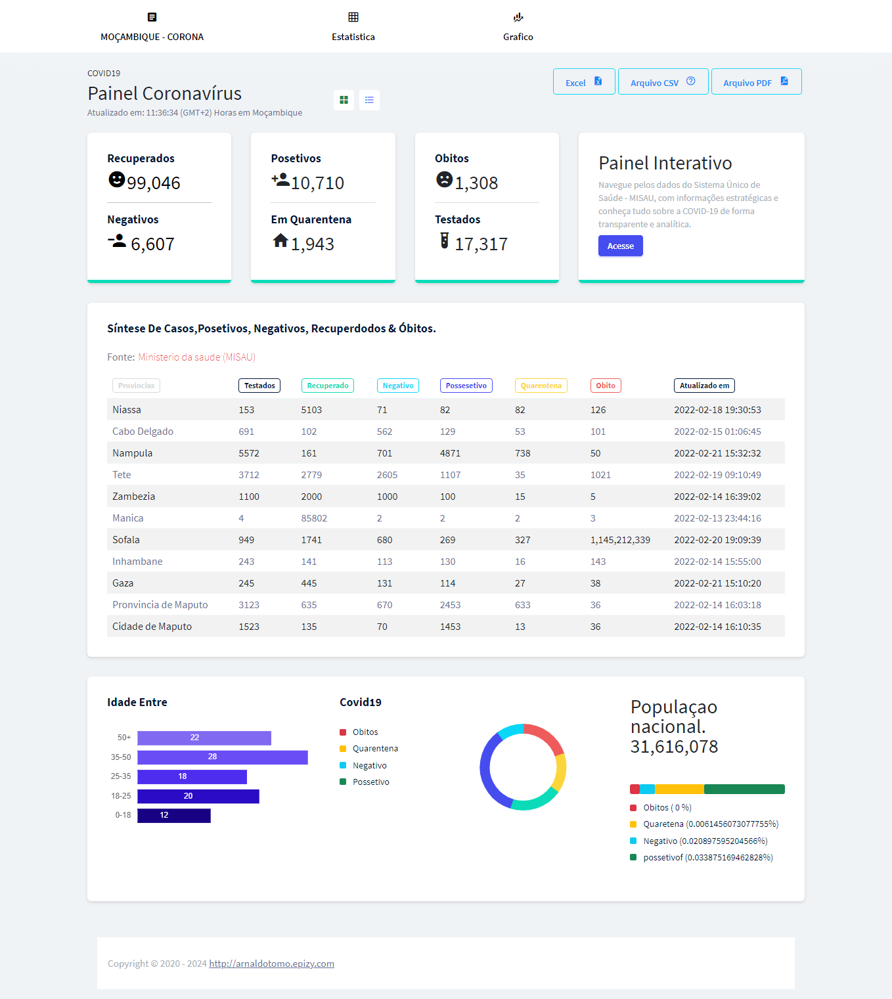
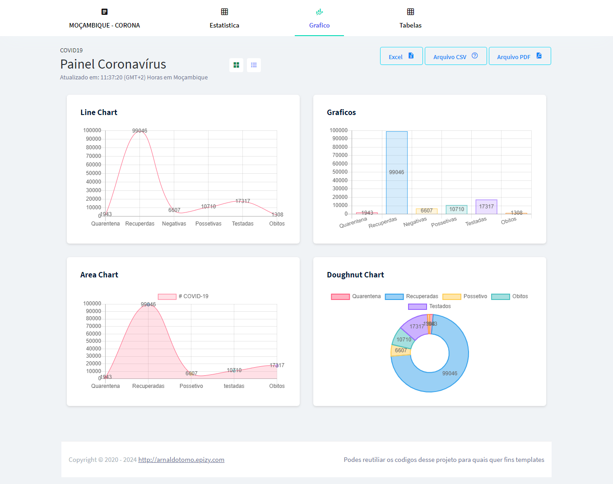
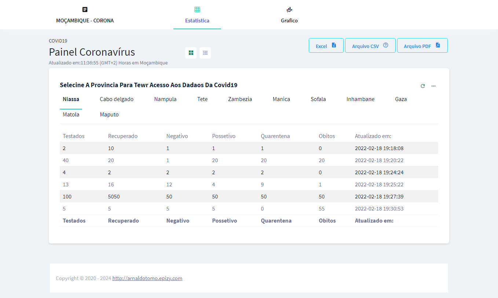

# Controle da COVID-19 em Moçambique 🦠🌍

Bem-vindo ao projeto de Controle da COVID-19 em Moçambique! Este sistema inovador fornece uma visão abrangente e em tempo real dos resultados da COVID-19 em todas as províncias de Moçambique. Desenvolvido com paixão e dedicação, o projeto visa oferecer informações precisas e acessíveis para auxiliar nas decisões relacionadas à saúde pública.

## Recursos Principais 🚀
- **Monitoramento em Tempo Real:** Atualizações instantâneas dos casos, óbitos, testes e mais.
- **Detalhes por Província:** Explore dados específicos de cada região para uma compreensão mais aprofundada.
- **Visualizações Abertas e Intuitivas:** Gráficos e estatísticas fáceis de entender para uma análise eficaz.

## Capturas de Tela 📸

## Como Contribuir 🤝
Se você gostaria de contribuir para este projeto, confira nosso guia de contribuição [aqui](CONTRIBUTING.md). Ficamos felizes com qualquer ajuda ou sugestões!

## Licença 📝
Este projeto é licenciado sob a Licença MIT - veja o arquivo [LICENSE](LICENSE) para detalhes.
